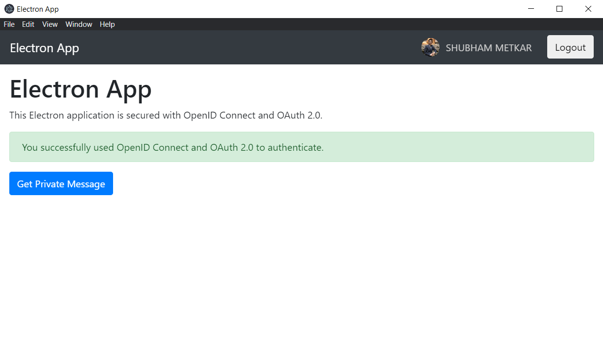

# PlAiforCause - Desktop App to play gesture based games for social cause
---
### PROBLEM DEFINITION :
- Almost every nation has a considerable amount of underprivileged communities, these people face so many problems in their lives due to lack of proper education, food, financial stability, etc.
- So NGO makes these people lives better by fulfilling or providing them their essential needs.However, NGOs at current face several problems to which they are not always prepared for.
- Lack of Funds: This is the most common problem NGOs need to constantly acquire funds. In some cases, NGOs become complacent and simply wait for donations or previous supporters to contact them. This practice will in no way contribute to the successes of an NGO. Although partner organizations and supporters will want to continually support an NGOs causes, they may possibly see more potential in other organizations and decide to fund others instead. Not having enough funds not only pose difficulties in accomplishing projects, but it also puts NGOs in jeopardy given that there are also many operational costs.

### PROPOSED INNOVATIVE SOLUTION:
- To address the above problem statement we’ve come up with an idea to develop a desktop application of ‘Human Gesture based games portal’. This is just like any other desktop application where user can get and run in their laptop/desktop
- In this app a user can play gesture based games on their device(which supports camera) & an advertisement from the sponsor will be shown in the app and amount of time the advertisement is shown correspondingly money will be deposited in the NGO’s wallet/bank account which NGO and sponsor both can monitor through online dashboards.
- User playing games can also get benefited with some exciting scratch-cards to reveal amazing rewards & coupons, user can also choose paid subscription where they no longer will be shown ads and also more amazing games will be open to play and part of this paid subscription can also be sent to the NGOs. Also user will indirectly contribute towards the noble cause.

### Technology

This project uses the following technologies:

- [Node.js](https://nodejs.org/)
- [Electron](https://www.electronjs.org/)
- [Auth0](https://auth0.com/)
- [Mediapipe](https://mediapipe.dev/)
- [python-shell](https://github.com/extrabacon/python-shell)
- [pygame](https://www.pygame.org/news)
- [NoSQL-database](https://www.mongodb.com/)
- [building-and-packaging](https://github.com/electron-userland/electron-builder/)

### Product & technology overview and working demonstration video:
https://drive.google.com/file/d/1X6Nl2CN5Bnzc3CpzLyz8yctc8shHHLRn/view?usp=sharing

### Running the Demo

To run this project, follow these steps:

1. Clone this repository (`git clone https://github.com/shubham2924/electron-authentication-app.git`)
2. Move to the `electron-openid-oauth/backend`  folder in your machine and run `npm install`
3. [Register the API with Auth0](https://auth0.com/blog/securing-electron-applications-with-openid-connect-and-oauth-2/#Call-a-Secure-API-within-Electron)
4. Rename the `env-variables.json.template` config file into `env-variables.json` and fill the required Auth0 parameters
5. Launch the API by running `npm start`
6. Move to the `electron-openid-oauth/frontend`  folder in your machine and run `npm install`
7. [Register the Electron application with Auth0](https://auth0.com/blog/securing-electron-applications-with-openid-connect-and-oauth-2/#Register-an-Electron-Application-with-Auth0)
8. Rename the `env-variables.json.template` config file into `env-variables.json` and fill the required Auth0 parameters
9. Launch the Electron app by running `npm start`

<!-- The following is a screenshot of the Electron application screen after logging in and clicking the *Get Private Message* button: -->

